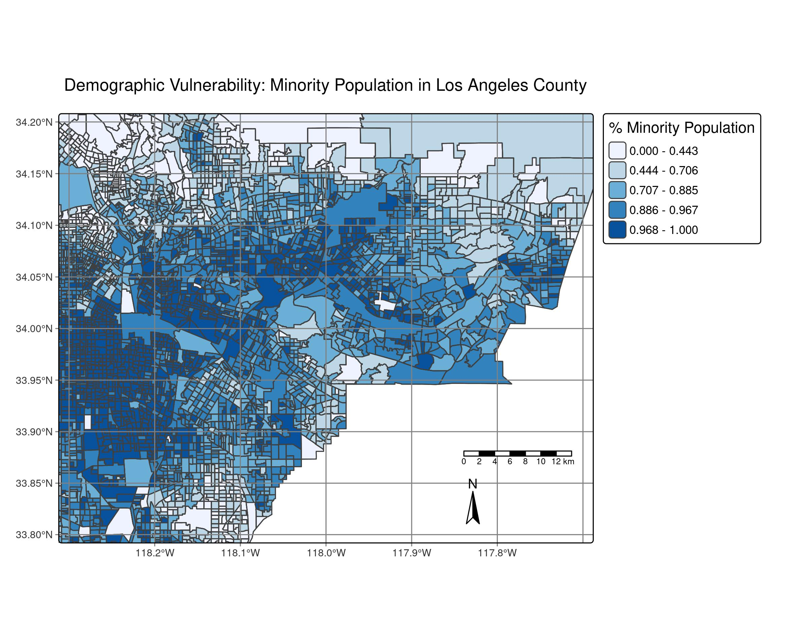

# EDS223-HW1

# Purpose
- The purposes of this repository is to hold files for the EDS 223
Homework #1.

# Description

- This repository includes:
  - A git ignore that ignores the data files when pushed
  - an RData file that houses all the data we needs for this assignments analysis
  - an .Rhistory file that notes all the changes done to the files in the repository
  - A data folder that houses all the data used for the analysis
  - An EDS223-HW1.Rproj file that is used to access the project from R Studio
  - An ej-screen.qmd file where the analysis is
  - This README.md file
  - A "figs" folder with a jpg file of LA County for the README for rendering purposes.
  
# Data Access Details
  - The data for this analysis was sourced from a google drive but originally sourced from the EPA's 
  - This zip file was then imported into a repository in RStudio and read in

# Contributors
  - The contributors of this data include the 
  
# References and/Or Acknowledgements

  
